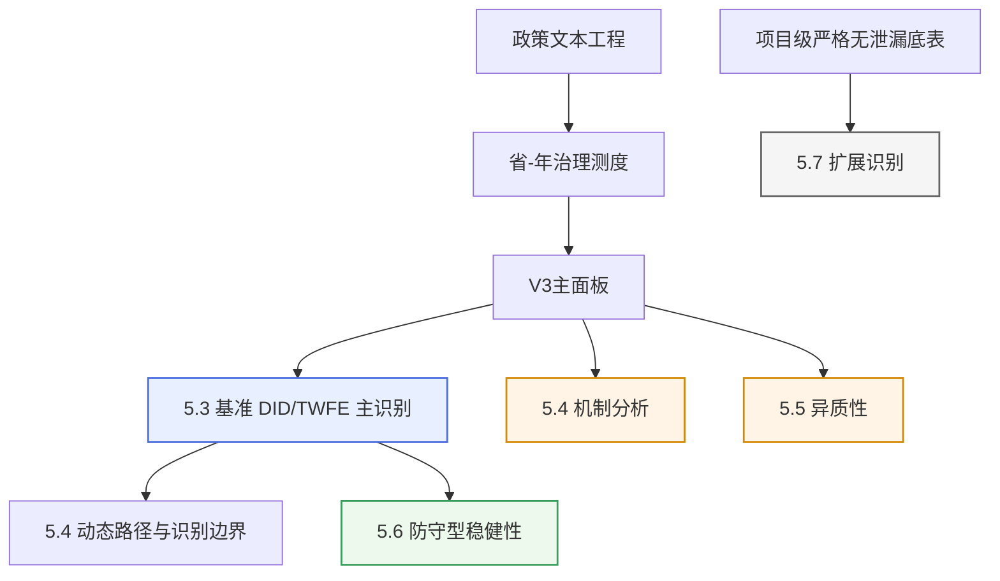

# 该稿的发表潜力与修订路径评估报告

## 执行摘要

我已按“正式结果优先、最新交接优先、正文实稿与结果表交叉核对”的原则，读取并比对了压缩包中的正式入口文件、V3结果层状态表、变量与模型采用口径表、主引用文件索引、5.3/5.4正式长表、DID补强结果包、两份 2026-04-17 文稿、原始 2026-04-15 文稿、原始综合数据总表，以及交接/记忆文件。就你关心的“翻成英文后能否达到较好英文期刊水平”这一问题，我的结论很明确：**不能靠“直接翻译”达到较好英文社会科学期刊的可投稿标准；现在的问题主要不是语言，而是版本统一、识别报告、文献嵌入、方法透明度与正文—结果一致性。** 就英文路线而言，这一领域实际对标的主要是 SSCI/Scopus 的公共管理、公共政策、数字政府与发展研究期刊，而不是狭义自然科学 SCI；期刊与数据库对“质量”的判断核心也是编辑规范、方法透明与学术影响，而不只是题目新颖。citeturn0search3turn3search0turn3search4turn8search3

如果把你说的“CSCI”按通常中文社科发表语境理解为 CSSCI/C刊 路线，那么**当前稿件已具备“论文雏形和主证据链”，但仍未达到可以放心直投的稳态**。如果以 0–5 分衡量，我对它目前的总体准备度判断是：**中文 CSSCI/C刊 路线约 2.5/5，较好英文 SSCI 路线约 1.6/5**。这不是在否定你的工作量，相反，数据与文件体系相当扎实，DID 防守性补强也确实让主识别更像一篇成熟论文；但要进入“较好期刊可投稿状态”，还必须完成一轮**结构性整修**，而不是只做润色。

最关键的四个阻碍是：第一，**结果版本并未完全统一**，5.3/5.4/8.* 已在 V3 主面板上重估，但第 6、7 部分的正式说明文件仍明确标注为 V2；第二，**某些正文叙事与正式结果不完全一致**，尤其是事件研究部分；第三，**文献综述与正文中几乎没有规范的文献嵌入**，这对英文期刊是硬伤；第四，**缺少投稿级别的方法报告部件**，包括正式模型式、识别假设说明、数据/代码可得性声明、伦理与复现说明。近年主流社会科学期刊与出版平台对研究透明度、数据可得性与开源规范的要求在持续抬高，这一点在作者指南与数据政策中都写得很清楚。citeturn2search0turn2search2turn2search5turn2search8turn2search17

## 已读取关键文件与版本裁决

### 已读取的关键文件

下表列的是我本次判断所依赖的关键文件，不是简单罗列文件名，而是按“功能—为何关键—在本次判断中的用途”进行裁决。

| 文件名 | 功能 | 为何关键 | 本次采用方式 |
|---|---|---|---|
| `000_请先看_完整总包说明_20260413_1345.txt` | 说明 v21 为当前唯一正式总包，界定根目录正式入口 | 用于确认“正式版”与历史包之间的层级关系 | 作为总包版本裁决依据 |
| `000_请先看_统一口径最终入口_v3正式落地_20260413_1345.txt` | 给出正式入口文件优先级 | 用于确认后续读取路径不被历史文件污染 | 作为读取顺序依据 |
| `README_统一口径总说明_v3正式落地_20260413_1345.txt` | 解释 v21 的重建逻辑与研究边界 | 确认哪些模块是正式主结果、哪些只是说明/历史 | 作为正式性判断依据 |
| `PPP_变量与模型最终采用口径表_20260413_1345.xlsx` | 规定正式主面板、正式文本口径、正式结果实体 | 这是全稿“什么能正式引用”的总开关 | 作为模型与结果的正式性依据 |
| `PPP_v3结果层状态表_20260413_1345.xlsx` | 标注哪些结果已在 V3 主面板上重估 | 直接决定“全稿是否真正统一 V3” | 作为版本冲突核对核心依据 |
| `01_.../97_当前主引用文件索引_20260413_1345.txt` | 为正文/附录提供优先引用结果文件 | 直接指向 5.3、5.4、8.6、9 部分正式文件 | 作为结果复核入口 |
| `4.17（21：00）gpt 输出记录.txt` | 最新交接/记忆文件 | 按时间排序最晚，且明确区分“已完成并采用/已降格/不宜继续投入” | **作为最新交接记忆优先采用** |
| `PPP_第5部分_5.3正式回归结果长表_V3_重估版_20260413_1048.csv` | 基准 DID/TWFE 官方长表 | 这是全文主识别最重要的正式结果实体 | 逐项复核 coef/SE/p/N |
| `PPP_第5部分_5.4动态系数长表_V3_重估版_20260413_1048.csv` | 事件研究官方长表 | 用于核对动态路径是否与正文表述一致 | 逐期复核 |
| `PPP_empirical_reinforcement_bundle_20260416_unified_v3/...` | DID 补强结果包 | 这是你本轮 DID 补强进入正文的正式材料来源 | 重点读取 trend/jackknife/wild 三层 |
| `PPP论文_完整论文初稿_公共管理风格_修订版_定点替换_20260415_DID补强整合版_20260417_final(1).docx` | DID 补强已并入的正文版本 | 5.6 结构最完整，最接近“实证结构正确整合版” | 作为 DID 整合质量主参考 |
| `PPP论文_完整论文初稿_公共管理风格_顶刊冲刺整合稿_20260417_对象保留版.docx` | 后续润色版正文 | 参考文献显著比上一版更完整 | 作为文献完成度与整体风格补充参考 |
| `PPP论文_完整论文初稿_公共管理风格_修订版_定点替换_20260415.docx` | DID 补强前正文底稿 | 用于比对补强前后章节替换是否到位 | 用于追踪正文演化 |
| `数据总表（一切数据基础）.xlsx` | 原始综合底表 | 用于判断是否还有继续补做检验的原始变量基础 | 作为“可继续追加实证”的可行性依据 |
| `参考文献/` 下 13 份 PDF | 文献包 | 用于判断文献基础的实际覆盖，而不是只看正文 refs | 抽查标题与主题覆盖范围 |

### 版本裁决与我采用的判定原则

我采用的不是“哪个文件名看起来更新就用哪个”，而是三层裁决：

第一层，**结果真值层**：以 v21 正式包、V3 结果状态表、采用口径表、主引用索引为准。  
第二层，**正文写作层**：以你后来上传的两份 2026-04-17 文稿为直接评估对象。  
第三层，**冲突裁决层**：当两份 4/17 文稿与正式结果表冲突时，**正式结果表优先**；当两份 4/17 文稿彼此冲突时，我分别取其优点并指出不能混用之处。

本次我采用的**最新交接记忆**是 `4.17（21：00）gpt 输出记录.txt`。原因很简单：它是时间上最晚的 handoff，而且内容上已经明确把全文主线稳定为“推进结构改善优先”，把 DID 补强明确定位为“主识别防守型补强”，并清楚区分了哪些结果能写成主结论、哪些只能降格处理。这一点与后续补强包 README、最终整合补丁文件是相互一致的。

### 我对当前论文实证组织逻辑的理解

你这篇论文现在的实证组织逻辑已经比较清楚，其骨架不是“方法堆砌”，而是如下证据层级：

这个结构本身是对的，而且最新交接、补强包说明与正文大方向是相互匹配的：**主识别只有一个，即 `treat_share` 多期 DID/TWFE；DID 补强不是另起一套识别，而是围绕主识别做防守性增强；ML 扩展不是第二主线。** 这一点从你当前的文件体系来看，逻辑是成立的。

但要害在于：**“逻辑设计统一”并不等于“底层结果已经完全统一”。** 正式状态表明确说 5.3、5.4、8.1–8.6 已在当前 V3 主面板上重估，而第 6、7 部分对应的正式说明文件仍然是 V2 四级十二类版本。这会直接影响英文投稿时的可信度判断。

## 关键实证复核与证据链判断

### 核心样本与估计口径复核

根据主面板文件、样本筛选表与正文表述，我核对到的正式口径如下：

| 项目 | 正式口径 |
|---|---|
| 面板时间范围 | 2014–2022 |
| 地区宇宙 | 31 省区市 + 新疆生产建设兵团，不含中央 |
| V3 主面板观测值 | 266 |
| 5.3 正式基准回归样本 | 262 |
| 5.3 省级聚类数 | 31 |
| 首次处理年份 | 2016 年 28 个地区；2017 年 1 个地区 |
| never-treated | 3 个地区 |
| 主处理变量 | `treat_share` |
| 主结果变量 | `exec_share`、`proc_share` |
| 辅助质量变量 | `ppp_quality_zindex` |

这套口径能够支撑一篇以省级多期 DID 为中心的公共管理经验论文，但需要在正文中用**正式模型式与样本流转说明**写得更清楚，否则审稿人只能从表格里猜。

### 核心主结果复核

我按正式 5.3 长表与补强包结果表核对出的关键数值如下：

| 结果变量 | 基准 DID/TWFE | 趋势调整 DID | Leave-one-province-out | Wild cluster bootstrap | 当前可写口径 |
|---|---:|---:|---:|---:|---|
| `exec_share` | 0.3556*** (SE=0.1002, p<0.001, N=262) | 0.2263 (SE=0.1744, p=0.1945) | 不翻号；1 次显著性跳变；最大偏离 0.0888 | coef≈0.3600, p=0.0761 | 可写“方向稳定，但强度对趋势设定与小样本推断更敏感” |
| `proc_share` | -0.4023*** (SE=0.1019, p<0.001, N=262) | -0.3521** (SE=0.1784, p=0.0485) | 不翻号；1 次显著性跳变；最大偏离 0.1699 | coef≈-0.4065, p=0.1221 | 可写“这是主结果中防守性最强的一条” |
| `ppp_quality_zindex` | 0.5253 (SE=0.4214, p=0.2126, N=262) | -0.1699 (SE=0.4093, p=0.6780) | 不翻号，但波动大；最大偏离 0.9610 | coef≈0.5226, p=0.2372 | 只能保留为边界性方向信号，不能写成稳健主结论 |

这个结果组合本身并不差。恰恰相反，它形成了一个很有公共管理味道的、而且相对克制的故事：**改革先改变推进结构，再谈更广义质量。** 这条主线是你这篇文章最有竞争力的地方。

### 我核对出的关键版本冲突与正文冲突

这部分非常重要，因为它直接决定“是否能过较好期刊的审稿门槛”。

| 冲突类型 | 我核对到的事实 | 对投稿的影响 |
|---|---|---|
| V3/V2 混用 | 5.3、5.4、8.* 已明确是 V3 重估；但第 6 部分机制与第 7 部分异质性的 README 仍明确写的是 `panel_v2`/`V2_四级十二类` | **重大风险**。英文审稿人会问：全文是否同一数据层？如果不是，为什么还能顺叙为一套主面板证据链？ |
| 事件研究叙事与正式结果不一致 | 在 `顶刊冲刺整合稿` 里，5.3 文字写成“处理后与基准结果一致、执行逐步上升、采购相应下降”；但正式 5.4 长表中，`exec_share` 在后 1、后 2、后 3+ 期系数为负，`proc_share` 在后 1、后 2、后 3+ 期系数为正 | **重大风险**。这不是“表达欠精炼”，而是正文与结果表的实质不一致 |
| 4/17 两份文稿优点分裂 | DID 补强整合版的 5.6 更成熟、更符合补强定位；对象保留版的参考文献较完整 | **中度风险**。当前稿不是单一、稳定版本，仍需要人工合并 |
| 引文系统未完成 | DID 补强整合版参考文献中仍有多条“期刊信息待核”；两份文稿正文几乎都没有规范的文内引文嵌入 | **硬伤**。英文期刊不能接受这种状态 |
| 编号与表述残留错误 | DID 整合版 5.7 仍有“表9以及图10、图11”之类编号残留，而正文实际只有图9与图10 | **小错误但非常伤观感**。审稿人会因此怀疑整稿是否真正完成过细读 |

我需要直说：**这些不是润色层问题，而是“还没到投稿定稿态”的证据。**

### 当前证据链最强与最弱的位置

最强的位置有三个：

其一，主识别问题已经清楚，不再摇摆。  
其二，DID 补强包的定位很专业：趋势调整、逐省剔除、小样本推断，均围绕“主识别防守”展开，而不是乱加新方法。  
其三，正文已经有较强的“边界意识”，没有把 `ppp_quality_zindex` 硬写成显著主结论。

最弱的位置也有三个：

其一，**动态路径部分在正式结果层面还不够安全**。对于多期、错位处理的 DID，近期方法文献已经反复指出，TWFE 事件研究会受到异质性与负权重污染，前导项显著并不一定只意味着“真前趋势”，后导项也可能被混合权重扭曲。citeturn5search0turn5search1turn5search2turn5search15

其二，**机制与异质性还没有和主识别完成同版本闭环**。  
其三，**国际文献对话几乎没有进入正文句级层面**。这意味着现在的稿子，哪怕译成英文，仍然会被读成“有结果、但没有把自己放进国际对话”的文章。

## 发表标准差距评估

### 评分矩阵

下面的分数不是“文章质量”的抽象打分，而是“离可投稿状态还有多远”的实务评分。0 表示基本不具备，5 表示已较接近该路线的投稿门槛。

| 维度 | 当前稿对中文 CSSCI/C刊 路线的准备度 | 当前稿对较好英文 SSCI 路线的准备度 | 依据 |
|---|---:|---:|---|
| 方法框架 | 3.5/5 | 2.4/5 | 文本工程 + 面板 DID + 机制/扩展，框架完整；但英文刊更看重 formal specification 与 estimand clarity |
| 识别可信度 | 2.7/5 | 1.8/5 | 基准 DID 主结果清楚，补强到位；但动态路径、版本混用、缺少异质性稳健 DID 主附录，拉低英文路线分数 |
| 叙事与论文结构 | 3.4/5 | 2.2/5 | 主线已收束为“推进结构改善优先”；但两份 4/17 文稿尚未合一，且部分小节叙事与正式结果仍打架 |
| 文献综述与引文系统 | 1.8/5 | 1.0/5 | 参考文献包存在，但文内引文系统几乎未建立；国际文献嵌入严重不足 |
| 图表与结果呈现 | 2.9/5 | 1.8/5 | 主结果表、补强表已有雏形；但图题编号、正文引用、主文/附录分配仍需再整理 |
| 中文学术写作 | 3.2/5 | 1.6/5 | 中文表达总体克制且成段；但英文期刊需要完全不同的写法逻辑，不是翻译问题 |
| 英文可发表性 | 1.2/5 | 1.0/5 | 当前缺少投稿级英文结构、句法压缩、参考文献规范与国际对话嵌入 |
| 伦理/数据可得性/复现 | 1.5/5 | 1.3/5 | 文件体系很强，但稿件里没有 DAS/CAS、伦理说明、样本流转说明；这在当前期刊规范下是实缺项 |

**综合判断**：  
**中文 CSSCI/C刊 路线：约 2.5/5。**  
**较好英文 SSCI 路线：约 1.6/5。**

### 为什么我给出这样的判断

英文公共管理与政策期刊通常要求的不是“做了很多分析”，而是**国际可读的问题设定、明确的理论贡献、可验证的识别策略、严格的报告规范**。像 Public Management Review、Public Performance & Management Review、Journal of Asian Public Policy、Public Organization Review、Government Information Quarterly、Review of Policy Research、Public Administration and Development、Governance 这类期刊，从官方 scope 看都强调高质量的理论—经验对接、治理与政策过程问题、以及能够进入国际讨论的经验发现。citeturn1search5turn1search6turn1search2turn4search2turn4search10turn9search0turn9search1

你这篇稿子现在最像的是：**已形成较强中文研究骨架、但尚未完成国际期刊所要求的“句级引文嵌入—模型透明—结果一致性—版本统一—开放科学表述”这最后一公里。** 这正是为什么我会判断它“离较好英文期刊还明显不够”。

尤其要强调，当前英文社会科学期刊对报告透明度与数据说明的要求比过去更高。无论是期刊选择流程中的编辑规范与最佳实践，还是出版社层面的数据政策与 data availability statement，都是实打实的投稿门槛。citeturn3search0turn3search4turn2search2turn2search5turn2search23

## 优先级修改清单

下面给的是**可执行清单**，不是泛泛建议。我按优先级分成 P0、P1、P2 三层。P0 不做，不建议投；P1 不做，英文路线很难成；P2 不做，也许还能投，但很难拿到好评。

| 优先级 | 改在哪 | 怎么改 | 为什么改 | 预期效果 |
|---|---|---|---|---|
| P0 | 第 4 章与第 5–7 章之间的版本说明；表6、表7来源 | **要么重跑第 6、7 部分到 V3 主面板；要么在正文明确披露其为既有正式输出，仅作辅助解释，并整体降格到附录/补充。** | 当前最严重的问题是“主识别用 V3，机制/异质性仍是 V2”，这会破坏整篇文章的可信度 | 解决“统一数据层叙事与底层结果不一致” |
| P0 | 第 5.3 节动态路径 | 把任何“执行逐步上升、采购相应下降”的句子全部改成：**“事件研究仅用于显示时序路径与识别边界。由于处理前领先项显著，且处理后系数未形成单调稳定路径，本文不将其作为平行趋势成立或效应逐步释放的强证据。”** | 当前 `顶刊冲刺整合稿` 的 5.3 与正式结果表直接冲突 | 防止审稿人一眼打穿全文 |
| P0 | 第 4.3–4.4 节 | 加入正式模型式、估计对象、FE/cluster/controls、处理定义、样本筛选说明。至少要出现一个标准化写法：`Y_pt = β TreatShare_pt + X'_ptγ + μ_p + λ_t + ε_pt`，并用文字说明识别假设与 clustering 口径 | 现在正文没有投稿级正式模型报告 | 让方法部分达到英文期刊基本标准 |
| P0 | 引言、文献综述、理论部分、结果解释段 | 重建文内引文。不是末尾堆 refs，而是在关键判断句后接作者—年份或目标期刊要求格式；并补齐全部缺失 bibliographic metadata | 目前正文几乎无文内引文；一版 refs 还保留“期刊信息待核” | 从“草稿”推进到“可投稿文本” |
| P0 | 参考文献节 | 合并两份 4/17 文稿的优势：以 `对象保留版` 的较完整条目为底，再回到 PDF 文献包把缺失期刊、卷期、页码逐条补全；同时把中文文献按目标英文期刊要求统一转为拼音/英译体例 | 参考文献不规范是英文投稿的直接退稿点 | 消除最显眼的形式性缺陷 |
| P1 | 第 5.4 节机制分析 | 重写机制口径：从“机制成立”改为“文本治理重心重分布与局部链路迹象”。尤其是 `B_idx` 为负这一点，必须解释其方向含义；如果解释不清，宁可删弱这部分 | 当前机制结论最大问题不是不显著，而是**方向含义不够透明** | 避免“指标方向到底代表改善还是收缩”的质疑 |
| P1 | 第 5.5 节异质性 | 只保留 1 段主体文字 + 1 张最必要的摘要表；把非显著交互项细节全部移附录。表内必须区分“主效应”和“interaction”而不是混在一起 | 当前异质性表述容易让人误读为显著分组结论 | 压缩噪音，保留边界信息 |
| P1 | 第 5.7 节扩展分析 | 如果目标是公共管理/公共政策英文刊，建议把 ML 部分压缩为**一段扩展应用说明 + 一张表**，ROC/PR/成本收益曲线移附录；如果主线仍显拥挤，可整节移补充材料 | 现在 ML 扩展虽有意思，但容易抢主线 | 让文章更像“一篇论文”，而不是“一组项目成果合集” |
| P1 | 文献综述第 2 章 | 把文献真正写成四个对话面：数字政府与公共价值、PPP/基础设施治理、政策文本量化进入治理测度、近年 staggered DID 识别规范 | 现在更多是主题概述，还不是“国际对话式综述” | 提升英文期刊最看重的 positioning |
| P1 | 方法附录 | 新增 heterogeneity-robust DID 附录：优先补 `Callaway–Sant’Anna` 或 `Sun–Abraham`；至少补一个 Goodman-Bacon 分解或等价解释，说明当前 staggered adoption 条件下 TWFE 的局限与为何主结论仍主要靠基准与防守层支撑 | 近年 DID 文献已明确提醒 TWFE 在错位处理下的潜在偏误 | 直接回应英文审稿人最常见方法质疑。citeturn5search0turn5search1turn5search2turn5search15 |
| P1 | 正文尾部或附录前 | 增加 Data Availability Statement、Code Availability Statement、Ethics/IRB Statement。建议写法是：数据来源于公开政策文本、PPP 项目数据库与省级统计/行政数据；将提供派生后的主面板、变量说明与复现代码；若有版权或平台限制，说明获取条件 | 现在文件很多，但稿子里没有“投稿级透明度声明” | 与期刊实践接轨。citeturn2search2turn2search5turn2search14turn2search23 |
| P2 | 图题、表题、正文编号 | 统一两份 4/17 文稿：修正“图10、图11”一类残留；统一 Figure 8A/8B 与表8的互文关系；把每个图/表注写成“结果层级说明”，而非只写图形内容 | 这是定稿质感问题 | 提升整体专业感 |
| P2 | 英文改写层 | 不做“逐句翻译”，而做“重新写作”：摘要、引言首段、贡献段、方法段、主结果段、限制段全部重写 | 中文论文腔与英文期刊论文腔差异很大 | 提升英文可发表性，而不是可读性而已 |

## 投稿策略与正文附录分配

### 我对投稿路线的建议

如果你的目标是**尽快形成稳定投稿稿**，我不建议现在直接走较好英文期刊。更现实的策略有两条：

第一条，**中文强修路线**。把版本统一、动态路径修正、文献嵌入、模型透明度、附录分层全部做完后，冲中文 CSSCI/C刊 更现实。就你当前材料基础看，这条路线的短期成功率高于英文直投。CSSCI 本身就是以中国人文社科期刊评价为核心的正式体系。citeturn8search1turn8search3

第二条，**英文重写路线**。如果你目标明确就是英文发表，那么请把它当作“重写一篇英文论文”，而不是“翻译一篇中文论文”。理由很简单：英文公共管理与政策期刊关注的是国际问题表达、理论对话位置、估计对象透明、结论克制与开放科学规范，而不只是结果表数量。citeturn1search5turn1search6turn4search2turn9search0turn9search1

### 适合的期刊层级与我给出的现实判断

| 期刊层级 | 可能的方向 | 当前稿是否建议直投 | 我的判断 |
|---|---|---|---|
| 冲刺型 | *Government Information Quarterly*、*Public Management Review*、*Governance*、*Journal of Public Policy* | 不建议 | 这些期刊更强调国际理论贡献、识别透明度与清晰的理论—经验对接。你现在距离这一层还不止是语言差距。citeturn4search10turn3search1turn9search1turn4search1 |
| 现实型英文路线 | *Journal of Asian Public Policy*、*Public Organization Review*、*Review of Policy Research*、*International Review of Public Administration*、*Public Administration and Development* | 在完成 P0+P1 后可考虑 | 这些期刊更能容纳区域治理、亚洲政策与公共组织研究，但仍要求文献与方法达到国际规范。citeturn1search6turn1search2turn4search2turn4search3turn9search0 |
| 主题重构型 | 若将文章更明显重构为基础设施/公用事业治理，可看 *Utilities Policy* | 需要改 framing 才可考虑 | 你现在的 framing 更偏公共管理，不是公用事业经济学 | citeturn1search13 |

我的具体建议是：

- **不要直接把当前稿翻成英文去投较好英文期刊。**
- 如果你一定要走英文路线，先完成 **P0 + P1**，然后再根据定位二选一：  
  - 走“数字政府 / 公共价值 / 服务交付”路线，就把 PPP 当治理场景，削弱 ML 扩展，强化国际数字政府文献；  
  - 走“PPP / 基础设施治理 / 政策执行”路线，就把文本工程和 ML 扩展都降级，把主线收束为“数字化改革如何改变中国地方 PPP 推进结构”。

### 正文必须保留、应移附录、建议仅备查的内容

| 层级 | 建议保留内容 |
|---|---|
| **必须保留在正文** | 研究问题与理论框架；文本变量工程的核心说明；表4基准 DID；一个谨慎写法的动态边界段；机制摘要表（若完成 V3 统一）；表8主识别防守摘要；结论中的边界与政策含义 |
| **宜移至附录** | 严格中介分解详细表；大部分非显著异质性细节；ROC/PR 图与成本收益曲线；工程版图；删一省全部长表；样本缺失清单的细表 |
| **建议仅备查，不进入正文主线** | PSM-DID 详细结果、IV 候选筛查细表、DML 详细系数、历史 V2 版本读物、工程审计 workbook |

如果你的目标是较好英文刊，我甚至会建议：**把 5.7 项目级扩展分析从主文降为 online appendix，只在结论里用两句话交代。** 因为当前主文最需要的是聚焦，不是丰富。

### 可直接替换的英文示例段落

下面给你三个可以直接作为重写模板的英文段落。它们不是逐字翻译，而是按英文期刊写法重新组织的。

**摘要结果句模板**

> This article examines whether digital government reform immediately improves overall PPP governance quality or instead first restructures the project pipeline through which projects move from procurement to implementation. Using a province-year panel and policy-text-based governance measures, we find that reform intensity is robustly associated with a higher implementation-stage share and a lower procurement-stage share, whereas the composite quality index remains directionally positive but statistically unstable.

**贡献段模板**

> The article makes three contributions. First, it relocates the study of digital government from generic efficiency outcomes to a concrete governance setting in which interdepartmental coordination, procedural standardization, and implementation linkage are directly observable. Second, it integrates policy-text analysis into variable construction rather than treating text mining as a stand-alone methodological exercise. Third, it shows that the earliest and most defensible effect of reform lies in restructuring the project advancement process, not in producing an immediate and across-the-board improvement in all governance-quality indicators.

**事件研究边界句模板**

> The event-study estimates are reported as diagnostic evidence on temporal patterns rather than as a strong validation of parallel trends. Because some lead coefficients are statistically significant and post-treatment coefficients do not form a stable monotonic path, the dynamic results are interpreted cautiously as boundary evidence rather than as an independent source of causal confirmation.

## 风险与反驳准备

下面列的是如果你按当前状态投稿，最可能遇到的主要质疑，以及你现在手里有什么证据、还缺什么。

| 审稿人质疑 | 你目前能拿出的证据 | 仍然缺什么 | 我的建议回应方式 |
|---|---|---|---|
| “TWFE 在错位处理下可能有偏” | 你已经有主识别 + trend-adjusted + jackknife + wild bootstrap；且处理主要集中于 2016，后续 cohort 很少 | 缺 heterogeneity-robust DID 的规范附录 | 补 `Sun-Abraham`/`Callaway-Sant’Anna` 或至少补方法说明。citeturn5search0turn5search1turn5search2 |
| “事件研究前趋势不平，后效应路径还与正文不一致” | 正式 5.4 长表已能证明你不是在硬说平行趋势成立 | 缺一版完全与正式长表一致的正文写法 | 立刻删掉“逐步上升/下降”的强句，改成边界说明 |
| “为什么机制和异质性不是同一数据版本？” | 你现在有状态表和口径表能说明哪些模块已 V3 重估 | 缺正文中的显性披露或重估结果 | 最优解是重跑到 V3；次优解是降格并透明披露 |
| “为什么质量指数不显著，还要谈治理提升？” | 你其实已经形成了很好的克制口径：主结论不是质量全面提升，而是推进结构优化 | 缺一句更清楚的理论闭合 | 把“结构改善优先”写成主要贡献，而不是退而求其次 |
| “机制里 `B_idx` 为负，你为什么说前端规范改善？” | 目前只有文字解释，没有清楚的方向定义 | 缺指标方向含义的显式界定 | 若不能解释清楚，就改写为“文本治理重心重分布”，不要写“改善” |
| “ML 扩展是不是另一篇论文？” | 你已经明确写了“预测不等于因果” | 缺主文篇幅上的聚焦 | 对英文路线建议移附录，只保留一句扩展用途 |
| “数据和代码能否复现？” | 你实际上有非常强的文件体系和脚本体系 | 缺正式的 DAS/CAS 与公开计划 | 必须加数据/代码声明。期刊和出版社现在普遍要求这些内容。citeturn2search2turn2search5turn2search23 |

从反驳准备角度说，你这篇论文其实并不是“没有证据”，而是“证据有了，但还没整理成投稿级防线”。这是好消息，因为这类问题可修，而不是不可修。

## 最终判断

我的最终判断是：

**这篇稿子即使翻译成英文，也还达不到较好英文 SSCI 期刊的发表标准。**  
原因不在于你没有数据，也不在于 DID 补强没做，而在于：**当前稿件仍然保留了版本不统一、动态叙事与正式结果不完全一致、文内引文系统缺失、模型报告不正式、透明度声明缺位等硬伤。**

但我也要非常明确地说：

**它并不是“没法救”的稿子。恰恰相反，它已经有了可救而且值得救的底子。**

如果你接下来做的是下面这组动作：

- 统一 V3 与 V2 结果层；
- 修正 5.3 动态路径叙事；
- 重建文内引文与国际文献对话；
- 加入正式模型报告与数据/代码/伦理声明；
- 收缩异质性和 ML 扩展，让主线更聚焦；

那么这篇文章会从“AI 协助完成的博士生初稿”，上升到“**有清晰主识别、有专业边界意识、有机会冲中文强刊或中等英文期刊的成熟论文**”。

再说得更直接一点：

- **现在的状态**：不能直接翻译后去投较好英文期刊。  
- **完成一轮高强度结构性修订后**：中文 CSSCI/C刊路线可以认真考虑；英文中等层级公共管理/政策期刊也有现实机会。  
- **若想冲更好英文期刊**：还需要再往上做两件事——一是把理论贡献真正国际化，二是把 DID 的识别报告提升到近年规范前沿。近年的 DID 方法文献已经把这套要求说得非常清楚。citeturn5search0turn5search1turn5search2turn5search15

因此，我给你的最核心结论只有一句：

**这篇稿子的问题，主要不是“英文还不够漂亮”，而是“还没完全进入投稿级纪律化状态”。先做结构修正，再谈翻译；先做版本与证据闭环，再谈冲更高期刊。**